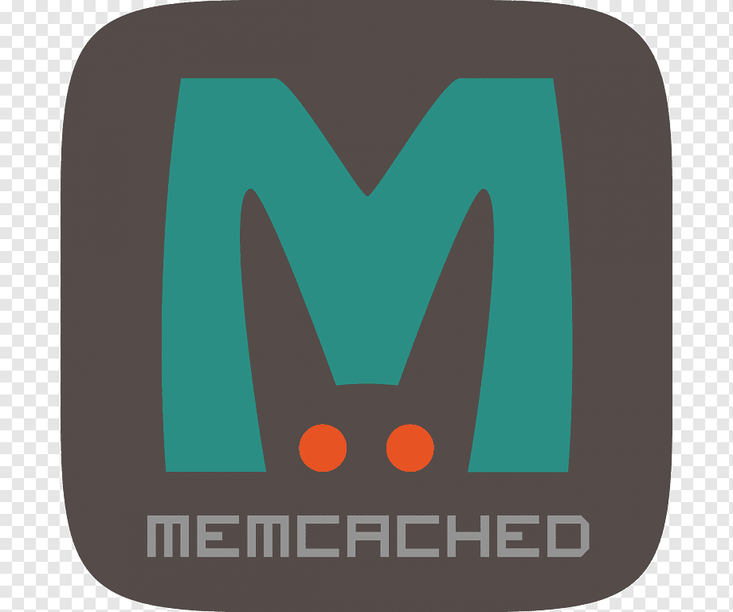
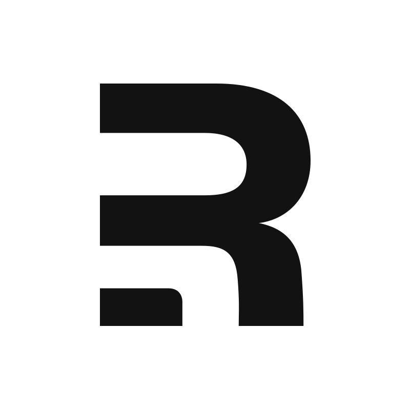
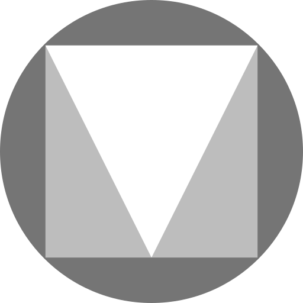
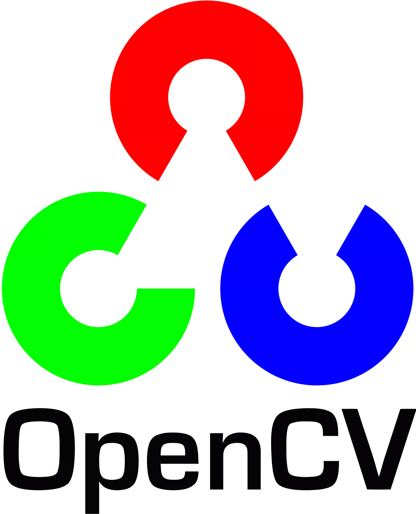
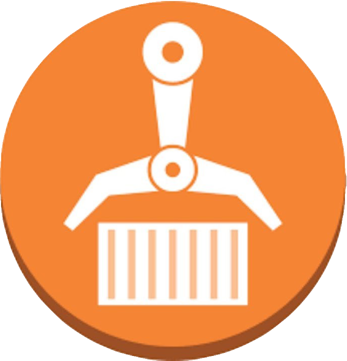
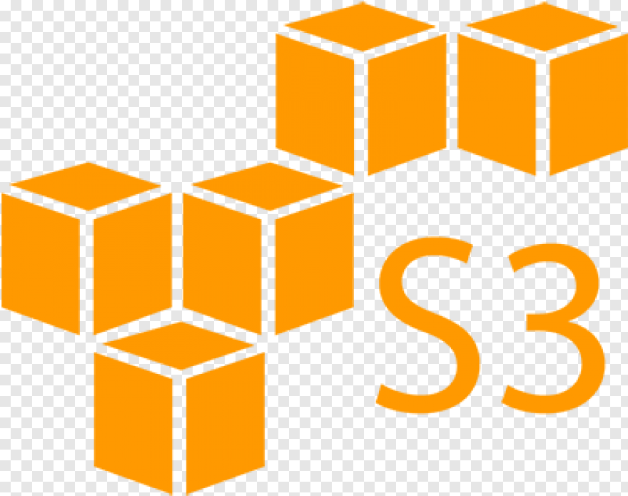
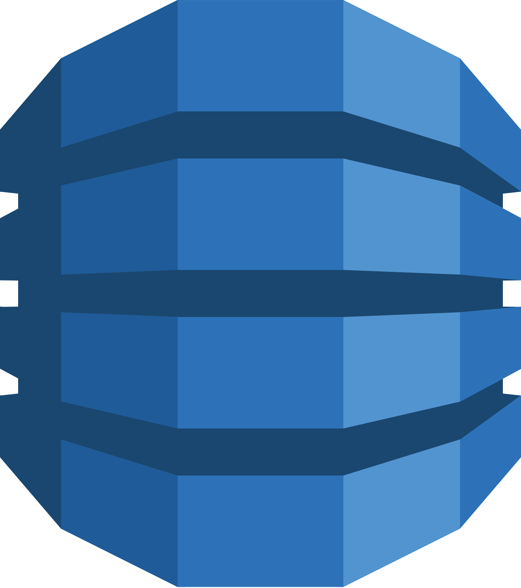
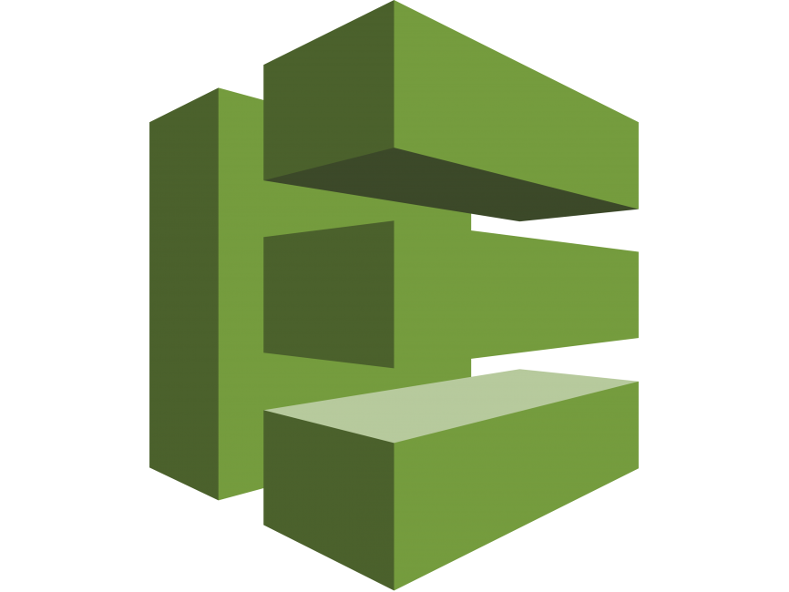
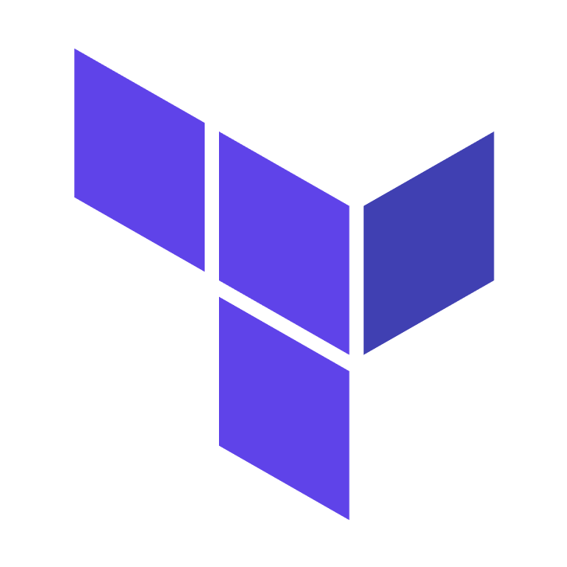
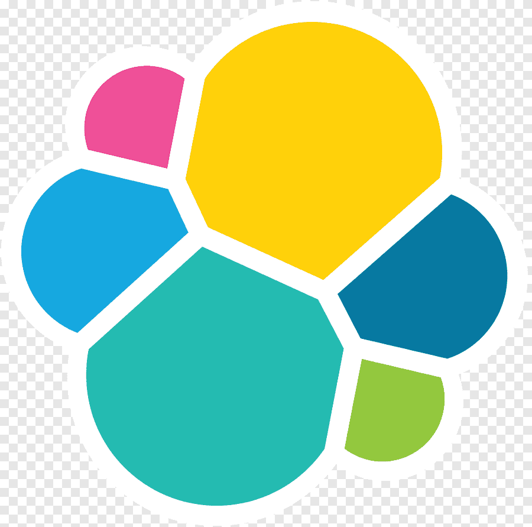

# 

## I'm a Intern Software Developer from Moscow

>I don't have much experience in commercial development, so I try to practice more

| Languages(Main)                                                                                              | Experience(Years) |Languages(Second)|Experience(Years)|
|----------------------------------------------------------------------------------------------------------|-------------------|---------|-----------------|
|    | **3.5**|            |**1.5**|
|             | **2.5**|        |**1**  |
|        | **2.5**  |       |**1.5**  |
|        | **1.5**||**1.5**|

>Yo bro, ты не думаешь, что было бы лучше «I haven’t mastered all of the tools listed below, 
>but I’ve spent over 20 hours of studying and practicing each of them»

## Backend Tools

## Frontend Tools

## Css Frameworks

## Big Data/ML Tools

## AWS Tools

## DevOps Tools

## Others

### My Contacts

